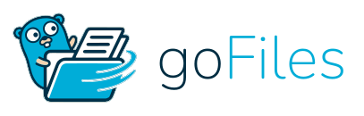

<p align="center">
  
</p>

<p align="center">
  <strong>Fast, self-contained, single-binary web file manager & WebDAV server written in Go.</strong>
</p>

<p align="center">
  <a href="https://github.com/G-Aman/goFiles/releases"></a>
  <a href="https://github.com/G-Aman/goFiles/actions/workflows/release.yml"></a>
  <a href="https://github.com/G-Aman/goFiles/pkgs/container/goFiles"></a>
  
</p>

<p align="center">
  <a href="#features">Features</a> •
  <a href="#downloads">Downloads</a> •
  <a href="#docker">Docker</a> •
  <a href="#quick-start">Quick Start</a> •
  <a href="#configuration">Configuration</a> •
  <a href="#access-control-acl">Access Control</a> •
  <a href="#license">License</a>
</p>

---

## Features

- **Single Self-Contained Binary:** All UI assets (HTML, CSS, JS, fonts, and SVG icons) are embedded directly into the Go binary at compile time via `//go:embed`. Zero external runtime dependencies.
- **Built-in WebDAV Server:** Mount your storage as a native network drive on Windows (File Explorer), macOS (Finder), Linux, or mobile (Cyberduck, Documents by Readdle).
- **Per-User Directory ACLs:** Granular permissions per path and user (`r` = read/download, `u` = upload, `w` = modify/rename/edit, `d` = delete).
- **Public Guest Access:** One-click toggle to share specific public folders (e.g. `/Public`) with unauthenticated visitors while keeping private files secured.
- **Resumable Chunked Uploads:** Upload files up to 50 GB+ with chunked parallel streaming, auto-retry on network drop, and live upload speed metering.
- **Remote URL Downloader:** Background downloading from direct HTTP/HTTPS links directly into any directory with real-time transfer speeds.
- **In-Browser Code Editor:** Integrated Ace editor supporting syntax highlighting for 50+ programming languages, line numbering, search/replace, and live saving.
- **Universal Media Viewer:** Native previews for images, video & audio streaming with byte-range seeking, markdown rendering, and PDF inspection.
- **Background Archive Jobs:** Asynchronous Zip / Tar archive creation and extraction with progress tracking in a bottom activity tray.
- **Modern Clean UI:** Responsive desktop & mobile interface with automatic Light and Dark theme adaptation.

---

## Downloads

Ready-to-run release packages for all architectures are available on the [**Releases Page**](https://github.com/G-Aman/goFiles/releases):

| OS / Architecture | Target | Package Link |
| :--- | :--- | :--- |
| **Linux (Standard 64-bit)** | `x86_64 / amd64` | [Download AMD64 ZIP](https://github.com/G-Aman/goFiles/releases/latest/download/gofiles-linux-amd64.zip) |
| **Linux (ARM 64-bit)** | `arm64 / aarch64` | [Download ARM64 ZIP](https://github.com/G-Aman/goFiles/releases/latest/download/gofiles-linux-arm64.zip) |
| **Linux (ARM 32-bit)** | `armv7 / armv5` | [Download ARMv7 ZIP](https://github.com/G-Aman/goFiles/releases/latest/download/gofiles-linux-armv7.zip) |
| **OpenWrt / Routers** | `mipsle / mips` | [Download MIPSLE ZIP](https://github.com/G-Aman/goFiles/releases/latest/download/gofiles-openwrt-mipsle-softfloat.zip) |
| **macOS (Apple Silicon)** | `arm64 / M1/M2/M3/M4` | [Download macOS ARM64 ZIP](https://github.com/G-Aman/goFiles/releases/latest/download/gofiles-darwin-arm64.zip) |
| **macOS (Intel)** | `x86_64 / amd64` | [Download macOS AMD64 ZIP](https://github.com/G-Aman/goFiles/releases/latest/download/gofiles-darwin-amd64.zip) |
| **Windows (64-bit)** | `x86_64 / amd64` | [Download Windows AMD64 ZIP](https://github.com/G-Aman/goFiles/releases/latest/download/gofiles-windows-amd64.exe.zip) |

---

## Docker

Multi-architecture images are published to the GitHub Container Registry (`ghcr.io`):

```bash
docker run -d \
  --name gofiles \
  -p 9001:9001 \
  -v /path/to/my/files:/data/files \
  -v /path/to/config:/data \
  --restart unless-stopped \
  ghcr.io/g-aman/gofiles:latest
```

---

## Quick Start

### 1. Run

```bash
# Run with defaults (serves current directory on 127.0.0.1:9001)
./gofiles -root ./my-files
```

### 2. First-Run Setup

When you first open `http://localhost:9001/` in your browser:
1. If no users exist, GoFM starts in setup mode.
2. Enter your desired **Admin Username** and **Password** to claim ownership.
3. Once claimed, the setup wizard self-disables and GoFM runs in protected mode.

---

## Configuration

Configuration is stored in `config.json` alongside the binary or specified via `-config /path/to/config.json`.

```json
{
  "app_name": "goFiles",
  "logo_url": "",
  "listen": "127.0.0.1:9001",
  "root": "/path/to/files",
  "path_prefix": "",
  "assets": "",
  "users": [
    {
      "name": "admin",
      "pass": "$2a$10$...",
      "home": "/"
    }
  ],
  "allow": {
    "write": true,
    "delete": true,
    "upload": true,
    "urlfetch": true,
    "archive": true,
    "extract": true,
    "edit": true,
    "chmod": true,
    "hash": true,
    "webdav": true
  },
  "max_upload_bytes": 50000000000,
  "chunk_bytes": 4000000,
  "theme": "auto",
  "lang": "en",
  "trust_proxy": true,
  "session_name": "gofm_session"
}
```

| Field | Default | Description |
| :--- | :--- | :--- |
| `listen` | `127.0.0.1:9001` | Address to listen on (`host:port` or `unix:/path.sock`). |
| `root` | `.` | Directory served by the file manager (created automatically if missing). |
| `path_prefix` | `""` | Sub-path prefix if deployed behind a reverse proxy (e.g. `files`). |
| `max_upload_bytes` | `50000000000` | Maximum file size in bytes (`0` = unlimited). |
| `chunk_bytes` | `2000000` | Chunk size for multipart chunked uploads (between 64KB and 64MB). |
| `trust_proxy` | `true` | Honour `X-Forwarded-For` and `X-Forwarded-Prefix` headers. |

---

## Access Control (ACL)

Permissions live in `acl.conf` in the same directory as `config.json`, keeping access control editable without restarting the server.

```text
# <user|@|*> / <path> : <perms>
#   r = read / list / download
#   u = upload NEW files
#   w = modify existing (rename, edit, chmod)
#   d = delete

# Allow anonymous visitors read-only access to /Public
@/Public:r

# Allow user 'bob' read, upload, and write access in /Project
bob@/Project:ruw

# Allow all authenticated users read access to /Shared
*@/Shared:r
```

- **Longest matching path wins.**
- **A named user rule beats `@` (anonymous) and `*` (all users).**
- **SuperAdmin has full bypass across the entire tree.**

---

## WebDAV Access

When enabled (`"allow": { "webdav": true }`), the WebDAV endpoint is available at `/dav/`:

- **URL:** `http://<host>:<port>/dav/` (or `http://<host>:<port>/<prefix>/dav/`)
- **Authentication:** HTTP Basic Auth using your configured user accounts.
- **Guest Access:** If public access (`@/path:r`) is configured, guests can browse without credentials.

### Connecting via Command Line (cURL)

```bash
# Upload a file via WebDAV
curl -u "user:password" -T document.pdf "http://localhost:9001/dav/document.pdf"

# List directory
curl -u "user:password" -X PROPFIND "http://localhost:9001/dav/"
```

---

## Building from Source

Requirements: Go 1.21+

```bash
# Clone the repository
git clone https://github.com/G-Aman/goFiles.git
cd goFiles

# Run tests
go test -v ./...

# Build the self-contained binary
go build -ldflags="-s -w" -o gofiles .

# Run
./gofiles
```

---

## License

MIT License. See [LICENSE](LICENSE) for details.
